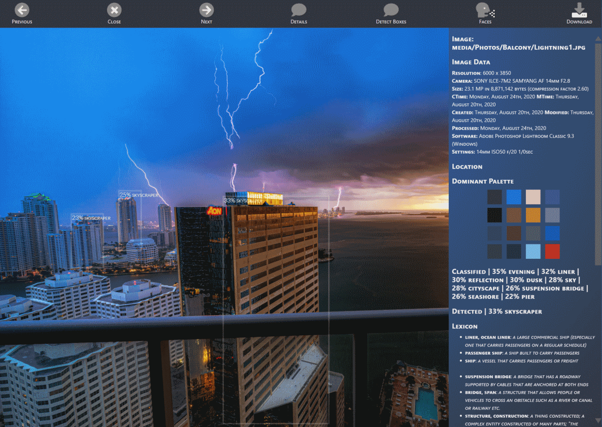
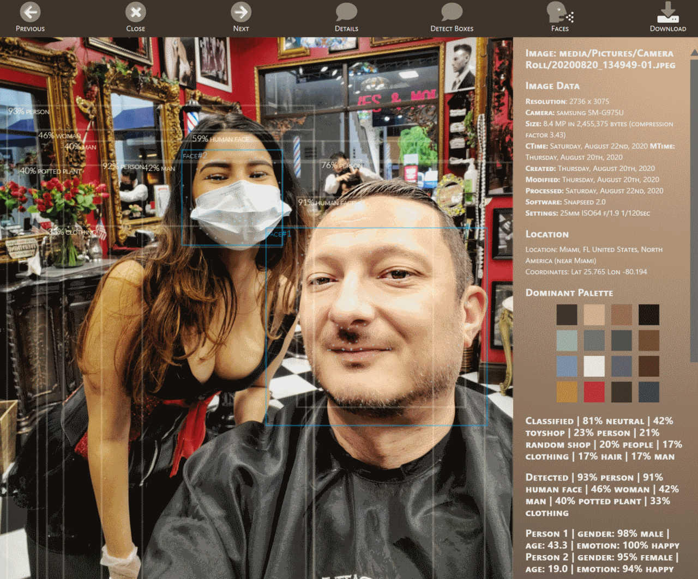
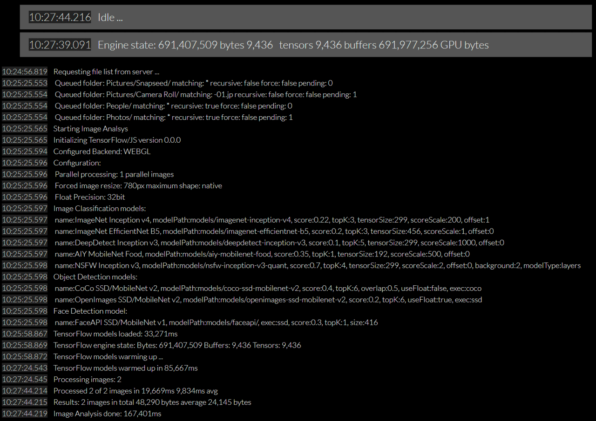

# PiGallery

## Secure & fast multi-user image gallery with machine learning image processing and analysis

<br>

## Key features

### At it's core, **PiGallery** builds a database of images which includes

- Image thumbnails for fast display
- Image analysis using machine learning using multiple image classification and object detection models
- Image perception hash to quickly locate duplicate image regardless of size or to search for simmilar images
- Image conditions using analysis of camera settings
- Person age, gender & emotion modelling and NSFW classification
- Image geo-location
- Lexicon definitions for complete image description
- Analysis is always incremental so only new or modified images will be analyzed
- All data is stored in a server-side database and original image is never modified

### As an image gallery viewer, **PiGallery** provides

- Secure, multi-user access to image database
- Fully responsive design for desktop & mobile usage
- Installable as an application (PWA) or can be used as a web page
- Client-side caching with incremental updates
- Flexible sorting and navigation using folders, locations or classes
- Flexible natural language search
- Quickly share generated albums with public users
- Locate and select images on a world map
- Find duplicate and/or simmilar images
- View image slideshow
- Multiple display themes (light & dark) and fully configurable user interface
- Play with machine learning detection of live video using your camera

### And it's **FAST**

- Initial access (no cache) of database with 10,000 images completes in less than 1 minute (depending on your network speed)
- Subsequent access (cached) with incremental database updates: less than 5 seconds for application startup and gallery load

<br>

*If you'd like to include any additional image analysis (additional machine models or static analysis), drop a note!*

<br>
<br>
<br>

## Screenshots

<center>

### Screenshot: Gallery view


### Screenshot: Detailed View





### Screenshot: Complex Search Results


### Screenshot: Live Video


### Screenshot: Image Processing



</center>

<br>
<br>
<br>

## Install, Configure & Run

### Install

- Install NodeJS: <https://nodejs.org/en/>
- Download PiGallery:
  using Git: `git clone --depth 1 https://github.com/vladmandic/pigallery`  
  or download archive from <https://github.com/vladmandic/pigallery/releases/>
- Install PiGallery:  
  run `./setup.js`

### Configure

Edit `config.json`:

```json
  {
    // list of users and their home folders (which is relative to global server.mediaRoot property)
    // if server.authForce is set to true, at least one valid user should be configured
    // admin property controlls if user has rights to process images or just view them as well as to manage anonymous shares
    "users": [
      { "email": "user@example.com", "passwd": "test", "admin": true, "mediaRoot": "media/" },
    ],
    // predefined user used for anonymous sharing, only works with generated share links
    "share": {
      "email": "share@pigallery.ddns.net", "passwd": "d1ff1cuTpa33w0RD", "admin": false, "mediaRoot": "share/"
    },
    // list of locations to scan for images to be processed
    "locations": [
      { "folder": "samples/", "match": ".jp", "recursive": true }
    ],
    "server": {
      "authForce": true, // force user authentication or allow anounymous users
      "httpPort": 8000, // http server port
      "httpsPort": 8080, // https server port
      "SSLKey": "/home/vlado/dev/piproxy/cert/private.pem", // https server key
      "SSLCrt": "/home/vlado/dev/piproxy/cert/fullchain.pem", // https server certificate
      "forceHTTPS": false, // redirect unsecure http requests to https
      "allowPWA": true, // allow application installation as pwa or limit to browser-only
      "logFile": "pigallery.log", // application log files
      "mediaRoot": "media/", // root folder for all image processing
      "allowedImageFileTypes": [ ".jpeg", ".jpg" ], // list of exensions that application will enumerate for processing
      "defaultLimit": 500, // number of images that server will send to browser in initial requests, remaining images are loaded in the background
      "db": "pigallery.db", // application image database
      "descriptionsDB": "assets/wordnet-synset.json", // application lexicon database, used during image processing
      "citiesDB": "assets/cities.json", // application geo-location database, used during image processing
      "warmupImage": "assets/warmup.jpg", // test image used to warm-up models at the start of image processing
    },
    // how to handle sessions from authenticated users, probably no need to modify
    "cookie": {
      "path": "./sessions",
      "secret": "whaTEvEr!42", "proxy": false, "resave": false, "rolling": true, "saveUninitialized": false,
      "cookie": { "httpOnly": false, "sameSite": true, "secure": false, "maxAge": 6048000001000 }
    }
  }
```

Optionally edit `client/config.js` for image processing settings  

```js
  const config = {
    backEnd: 'webgl',     // back-end used by tensorflow for image processing, can be webgl, cpu, wasm
    floatPrecision: true, // use 32bit or 16bit float precision
    maxSize: 780,         // maximum image width or height that will be used for processing
    renderThumbnail: 230, // resolution in which to store image thumbnail embedded in result set
    batchProcessing: 1,   // how many images to process in parallel
  }
```

Optionally edit `client/model.js` to select active models for both image processing and live video  

For details on model configuration, how to fine-tune them as well as where to find and how to convert models, see <https://github.com/vladmandic/pigallery/MODELS.md>

### Run

Run server application using `npm start`  

- Optionally use provided `pigallery.service` as a template to run as a Linux systemd service

Use your browser to navigate to server

- Default view is image gallery.
  If there are no processed images, it's blank
- Select `User`->`Update DB` to start image processing
- Select `Live Video` to process live video from your device camera

<br>
<br>
<br>

## General Notes

### Metadata

Processing builds tags from all available image metadata:

- Image Metadata:
  - Size, Creation and Modification timestamps
  - Camera & lens details and settings used for image capture
  - Software used for editing, etc.
  - GPS Coordinates
    Matched to location database for place description and location of nearest larger center for purpose of groupping
- Image Analysis
  - Multiple iamge classification models
  - Multiple object detection models
  - Face age/gender/emotion detection
  - NSFW detection
  - Perception hash calculation
    Used to compare image simmilarity between any images or to find simmilar images
- Lexicon lookups for any detected terms
  - This includes hierarchical lookups - for example, *gown* will also include *dress, clothing, etc.*

Collected metadata is additionally analyzed to render human-readable search terms

- Age can be specified as: *20ies, 30ies, kid, old, etc.*
- Camera settings can be specified as: *bright, dark, indoors, outdoors, etc.*
- Lens settings can be specified as: *superzoom, zoom, portrait, wide, ultrawide*
- Special words can be used in search terms to form a sentence: *the, a, in, wearing, having, etc.*

### Search

Result of all metadata processing is a very flexbile search engine - take a look at this example:  
`"Happy female in 20ies in Miami wearing dress and dining outdoors"`

### Navigation

#### Keyboard shortcuts

```text
  ENTER : Execute any open input
  ESC   : Close any dialogs and reset view
  \     : Reload data
  /     : Open search input
  .     : Open sort interface
  ,     : Show/hide image descriptions in gallery view
  Arrow Left & Right : Previous & Next image when in detailed view
  Arrow Up & Down: Scroll up & down by one line when in gallery view
  Page Up & Down: Scroll up & down by one page when in gallery view
  Home & End: Scroll to start & end when in gallery view
```

#### Swipe controlss

- Swipe down will refresh image database
- Swipe left and right are previous and next image in details view

<br>
<br>
<br>

### Links

- **Code Repository**: <https://github.com/vladmandic/pigallery>  
- **Changelog**: <https://github.com/vladmandic/pigallery/CHANGELOG.md>  
- **Todo List**: <https://github.com/vladmandic/pigallery/TODO.md>  
- **Notes on Models**: <https://github.com/vladmandic/pigallery/MODELS.md>  

<br>
<br>
<br>
