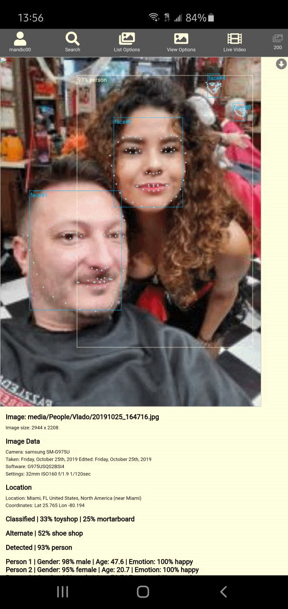

# PiGallery

## Multi-user image galley with TensorFlow/JS image processing and full EXIF data extraction and analysis

**Repository: <https://github.com/vladmandic/pigallery>**

## Screenshots

### Gallery view

### Detailed View

### Complex Search Results

### Live Video

## Install, Configure & Run

### Install

#### Quick

      git clone --depth 1 https://github.com/vladmandic/pigallery
      ./setup.js

#### Manual

- Install NodeJS: <https://nodejs.org/en/>
- Download application: <https://github.com/vladmandic/pigallery/archive/master.zip>
- Unpack it
- Install dependencies: `npm run upgrade`

### Configure

- Edit `data/config.json` for general settings
  - `server.mediaRoot` must point to a valid folder containing your images, can be a symbolic link
  - `users.*.mediaRoot` is a starting point for a user, can be same as `server.mediaRoot` if you want user to have access to all media files, otherwise it should be the subfolder within `server.mediaRoot`
  - If you want to run HTTPS server, provide your private key and certificate, otherwise disable by setting port to 0
- Edit `client/config.js` for image processing settings.
  - TensorFlow pretrained models can be loaded from a local storage or use provided HTTP locations
- Populate your `server.mediaRoot` folder with images you want analyzed and cataloged

### Run

- Run server application using `npm start`
  - Server uses ParcelJS to build distribution in `./dist` and starts ExpressJS HTTP and HTTPS servers
- Use your browser to connect to server
  - By default, web access requires authentication, see `data/config.json` for user configuration
  - Default view is image gallery. If there are no processed images, it's blank
  - Select `Update Database` to start image processing (opens separate browesr window)
  - Select `Live Video` to play with your webcam or provide mp4 video file

## General Notes

### Metadata

Processing builds tags from all available image metadata:

- Image size in MP
- Image timestamp determined from EXIF data if present or using FS stat if not
- Each part of the image path
- TensofFlow
  - Primary and alternate image classification as defined by ImageNet 1,000 classes <http://image-net.org/>
  - Object detection as defined by Coco 90 classes <http://cocodataset.org/>
  - Face, age and gender analysis using <https://github.com/justadudewhohacks/face-api.js>
- Definition lookup for any term detected by TensorFlow
  - Definition lookup is done using WordNet Lexical Database <https://wordnet.princeton.edu/>
  - This includes hierarchical lookups - for example, *gown* will also include *dress, clothing, etc.*
- EXIF data extracted from image:
  - Location with lookup of geographic location and nearest large city
  - Location database includes 195,175 places from <geonames.org>
  - Camera make, model and lens
  - Camera settings used to take the photo
  - Software used to edit the photo
- Perception hash for image:
  - Used to compare image simmilarity

Collected metadata is additionally analyzed to render human-readable search terms

- Age can be specified as: *20ies, 30ies, kid, old, etc.*
- Camera settings can be specified as: *bright, dark, indoors, outdoors, etc.*
- Lens settings can be specified as: *superzoom, zoom, portrait, wide, ultrawide*
- Special words can be used in search terms to form a sentence: *the, a, in, wearing, having, etc.*

### Search

Result of all metadata processing is a very flexbile search engine - take a look at this example:

`"Happy female in 20ies in Miami wearing dress and dining outdoors"`

### Keyboard shortcuts

      ENTER : Execute any open input
      ESC   : Close any dialogs and reset view
      \     : Reload data
      /     : Open search input
      .     : Open sort interface
      ,     : Show/hide image descriptions in gallery view
      Arrow Left & Right : Previous & Next image when in detailed view
      Arrow Up & Down: Scroll up & down by one line when in gallery view
      Page Up & Down: Scroll up & down by one page when in gallery view
      Home & End: Scroll to start & end when in gallery view

### TensorFlow Processing

- On errors:
  - If you get `Error: Failed to compile fragment shader`, you've run out of GPU memory. Just restart processing and it will continue from the last known good result.
- On images:
  - This relates to selected image size in `client/config.js`, not the original image size which can be anything (tested with over 100MP)
  - Large images can cause random WebGL processing errors, recommended limit is 1000px.
  - There is no increased accuracy in image sizes larger than 800 pixels as individual classification samples are typically 224px.
  - Increase of resolution from 800px to 1000px doubles processing time
  - Smaller objects are easier to detect due to cleaner bounding boxes. Image with single large object that covers 100% of the image is worst-case scenario.
- On batch processing:
  - If performing specific performance tests, limit batch size to 1 as batch processing skews performance measurements
  - Batch sizes above 10 do not further increase performance.
  - Can lead to out of memory errors in your GPU
- On pretrained models
  - Size of pretrained model is not related to performance as larger models can sometimes predict objects easier.
  - If model is depth-based, testing is provided with depth factor 1.0. Lower depth decreases accuracy and higher depth rarely increases it.
  - Typcal resolution for selected pretrained models is 224px resolution although it can vary
  - Model load time can be from few seconds to over a minute depending on model size (in MB)
  - Model warm-up time can be from few seconds to over a minute depending on model complexity (number of tensors)

### Model Benchmarks

- Using Intel i7 with nVidia GTX-1050
- Sample is of 1,000 random images with processing size normalized to 780px
- Testing is performed using 32bit float precision configured in `client/config.js`.
- Switching to 16bit precission can increase performance by additional 5-10%.

### Model Notes

- Best column marks hit when model has produces significantly better result than other models
- Classification: RESNet bassed models try to guess while Inception and MobileNet based models are willing to leave result out on no match
- Classification: As seen with EfficientNet, accuracy increases drastically with model resolution, but it also significantly increases processing time
- Classification: RESNet based models have long load times due to size, but only have sightly higher accurancy than small MobileNet or Inception models
- Classification: Models with high class number have low accuracy unless you go all-in with large models

### Model Recommendations

- Classification: For mobile and/or high performance, go with either MobileNet v2 or EfficientNet B0. Below 20MB and 140ms/image.
- Classification: For high accuracy go with high resolution EfficientNet model and optionally augment results with Inception v3.

## Links

- TensorFlowJS: <https://www.tensorflow.org/js/>
- Datasets: <https://www.tensorflow.org/resources/models-datasets>
- MobileNet: <https://github.com/tensorflow/models/blob/master/research/slim/nets/mobilenet/README.md>
- Inception: <https://towardsdatascience.com/review-inception-v4-evolved-from-googlenet-merged-with-resnet-idea-image-classification-5e8c339d18bc>
- DarkNet Yolo: <https://pjreddie.com/darknet/yolo/>
- Face/Gender/Age: <https://github.com/justadudewhohacks/face-api.js>
- EfficientNet: <https://github.com/tensorflow/tpu/tree/master/models/official/efficientnet>

