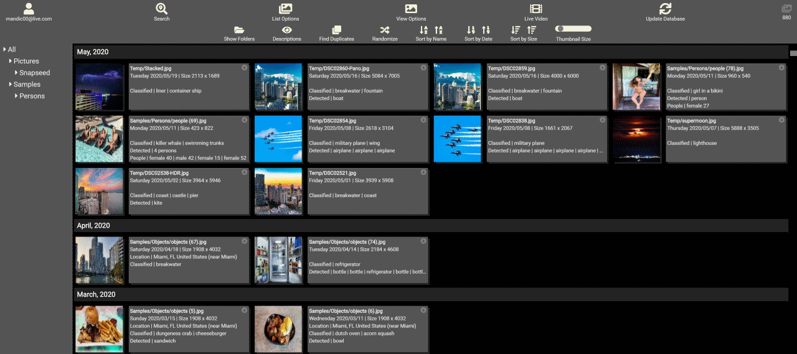
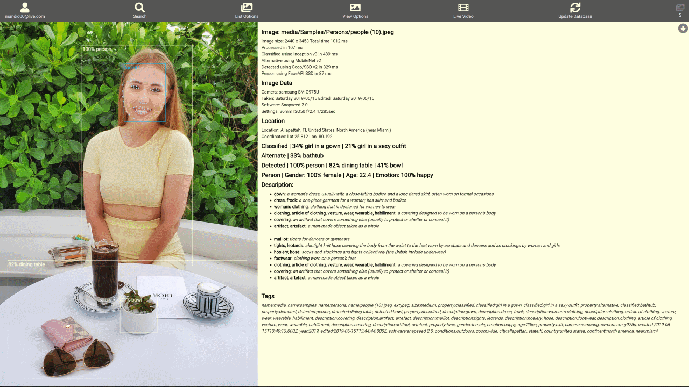
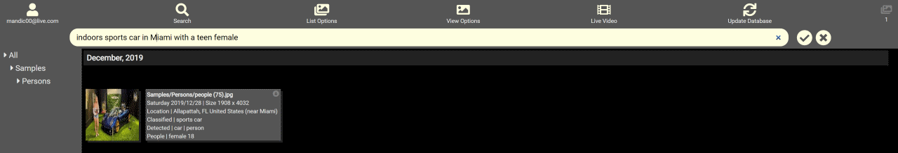

# PiGallery

## Multi-user image galley with TensorFlow/JS image processing and full EXIF data extraction and analysis

**Repository: <https://github.com/vladmandic/pigallery>**

## Screenshots

### Gallery view

### Detailed View

### Complex Search Results

## Install, Configure & Run

### Install

#### Quick

      git clone --depth 1 https://github.com/vladmandic/pigallery
      npm run upgrade

#### Manual

- Install NodeJS: <https://nodejs.org/en/>
- Download application: <https://github.com/vladmandic/pigallery/archive/master.zip>
- Unpack it
- Install dependencies: `npm run upgrade`

### Configure

- Edit `data/config.json` for general settings
  - `server.mediaRoot` must point to a valid folder containing your images, can be a symbolic link
  - `users.*.mediaRoot` is a starting point for a user, can be same as `server.mediaRoot` if you want user to have access to all media files, otherwise it should be the subfolder within `server.mediaRoot`
  - If you want to run HTTPS server, provide your private key and certificate, otherwise disable by setting port to 0
- Edit `client/config.js` for image processing settings.
  - TensorFlow pretrained models can be loaded from a local storage or use provided HTTP locations
- Populate your `server.mediaRoot` folder with images you want analyzed and cataloged

### Run

- Run server application using `npm start`
  - Server uses ParcelJS to build distribution in `./dist` and starts ExpressJS HTTP and HTTPS servers
  - Note that files in `./dist` are provided only for reference as they will be rebuild on each server start from files in `./client`
- Use your browser to connect to server
  - By default, web access requires authentication, see `data/config.json` for user configuration
  - Default view is image gallery. If there are no processed images, it's blank
  - Select `Update Database` to start image processing (opens separate browesr window)
  - Select `Live Video` to play with your webcam or provide mp4 video file

## General Notes

### Metadata

Processing builds tags from all available image metadata:

- Image size in MP
- Image timestamp determined from EXIF data if present or using FS stat if not
- Each part of the image path
- TensofFlow
  - Primary and alternate image classification as defined by ImageNet 1,000 classes <http://image-net.org/>
  - Object detection as defined by Coco 90 classes <http://cocodataset.org/>
  - Face, age and gender analysis using <https://github.com/justadudewhohacks/face-api.js>
- Definition lookup for any term detected by TensorFlow
  - Definition lookup is done using WordNet Lexical Database <https://wordnet.princeton.edu/>
  - This includes hierarchical lookups - for example, *gown* will also include *dress, clothing, etc.*
- EXIF data extracted from image:
  - Location with lookup of geographic location and nearest large city
  - Location database includes 195,175 places from <geonames.org>
  - Camera make, model and lens
  - Camera settings used to take the photo
  - Software used to edit the photo

Collected metadata is additionally analyzed to render human-readable search terms

- Age can be specified as: *20ies, 30ies, kid, old, etc.*
- Camera settings can be specified as: *bright, dark, indoors, outdoors, etc.*
- Lens settings can be specified as: *superzoom, zoom, portrait, wide, ultrawide*
- Special words can be used in search terms to form a sentence: *the, a, in, wearing, having, etc.*

### Search

Result of all metadata processing is a very flexbile search engine - take a look at this example:

`"Happy female in 20ies in Miami wearing dress and dining outdoors"`

### TensorFlow Processing

- On errors:
  - If you get `Error: Failed to compile fragment shader`, you've run out of GPU memory. Just restart processing and it will continue from the last known good result.
- On images:
  - This relates to selected image size in `client/config.js`, not the original image size which can be anything (tested with over 100MP)
  - Large images can cause random WebGL processing errors, recommended limit is 1000px.
  - There is no increased accuracy in image sizes larger than 800 pixels as individual classification samples are typically 224px.
  - Increase of resolution from 800px to 1000px doubles processing time
  - Smaller objects are easier to detect due to cleaner bounding boxes. Image with single large object that covers 100% of the image is worst-case scenario.
- On batch processing:
  - If performing specific performance tests, limit batch size to 1 as batch processing skews performance measurements
  - Batch sizes above 10 do not further increase performance.
  - Can lead to out of memory errors in your GPU
- On pretrained models
  - Size of pretrained model is not related to performance as larger models can sometimes predict objects easier.
  - All models are pretrained using ImageNet dataset with 1,000 classes <http://image-net.org/>
    - Ideally, models should be trained using full ImageNet dataset that contains 14,197,087 images in 21,841 classes
  - If model is depth-based, testing is provided with depth factor 1.0. Lower depth decreases accuracy and higher depth rarely increases it.
  - Typcal resolution for selected pretrained models is 224px resolution although it can vary
  - Model warm-up time can be from few seconds to over a minute depending on model complexity

### Model Benchmarks

- Using Intel i7 with nVidia GTX-1050
- Sample is of 1,000 random images with processing size 800px
- Testing is performed using 32bit float precision configured in `client/config.js`.
- Switching to 16bit precission can increase performance by additional 5-10%.

#### Image Classification

| Model               | Size   | Tensors | Accuracy | False Positive | Performance |
|---------------------|--------|---------|----------|----------------|-------------|
| MobileNet v1        |  16 MB |  72     | 82.81%   | 13.2%          |  99 ms      |
| MobileNet v2        |  13 MB | 125     | 82.81%   |  3.5%          | 104 ms      |
| Inception ResNet v2 | 223 MB | 500     | 89.84%   | TBD            | 135 ms      |
| ResNet v2           | 178 MB | 283     | 81.25%   | TBD            | 150 ms      |
| Inception v1        |  26 MB | 120     | 78.13%   | TBD            | 105 ms      |
| Inception v2        |  44 MB | 145     | 78.13%   | TBD            | 110 ms      |
| Inception v3        |  95 MB | 194     | 85.94%   |  9.5           | 127 ms      |
| NasNet Mobile       |  21 MB | 574     | 78.91%   | TBD            | 119 ms      |

 
*It's a tight race between MobileNet v2 with it's small size and low number of false positives .vs.
Inception v3 with long warmup time, good top results but also higher number of false positives.
Note that Inception rates it's hits very high, so if its combined with some other model, it would always end on top.
ResNet on it's own is not that great, but Inception based on ResNet does provide results although that comes with high cost in warmup times and memory usage.*

#### Image Object Detection

| Model                | Size   | Tensors | Accuracy | False Positive | Performance |
|----------------------|--------|---------|----------|----------------|-------------|
| Coco/SSD v2          |  67 MB | 202     | 60.94%   |  1.8%          | 147 ms      |
| DarkNet/Yolo v1 Tiny |  63 MB |  42     | 34.38%   | TBD            | 139 ms      |
| DarkNet/Yolo v2 Tiny |  44 MB |  42     | 50.00%   | TBD            | 145 ms      |
| DarkNet/Yolo v3 Tiny |  35 MB |  59     | 29.69%   | TBD            | 136 ms      |
| DarkNet/Yolo v1 Full | 248 MB | 366     | 62.50%   | TBD            | 280 ms      |

 
*With object detection accuracy is typically lower, but there are much fewer false-positives.
This allows for fallback solutions - if one model does not perform well on an image, you can try another.*

## Links

- TensorFlowJS: <https://www.tensorflow.org/js/>
- Datasets: <https://www.tensorflow.org/resources/models-datasets>
- MobileNet: <https://github.com/tensorflow/models/blob/master/research/slim/nets/mobilenet/README.md>
- Inception: <https://towardsdatascience.com/review-inception-v4-evolved-from-googlenet-merged-with-resnet-idea-image-classification-5e8c339d18bc>
- DarkNet Yolo: <https://pjreddie.com/darknet/yolo/>
- Face/Gender/Age: <https://github.com/justadudewhohacks/face-api.js>

## Todo

- BUG: Live video slows down over time and leaks GPU memory
- BUG: Handle duplicate folder names
- RFE: server-side search, paging
- RFE: Save user preferences
- RFE: Process GIF, PNG and HEIF
- RFE: Server-side processing once WSL2 implements CUDA
- RFE: Installable PWA, cache results
