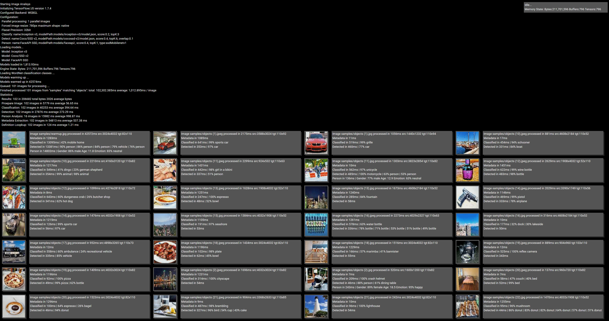
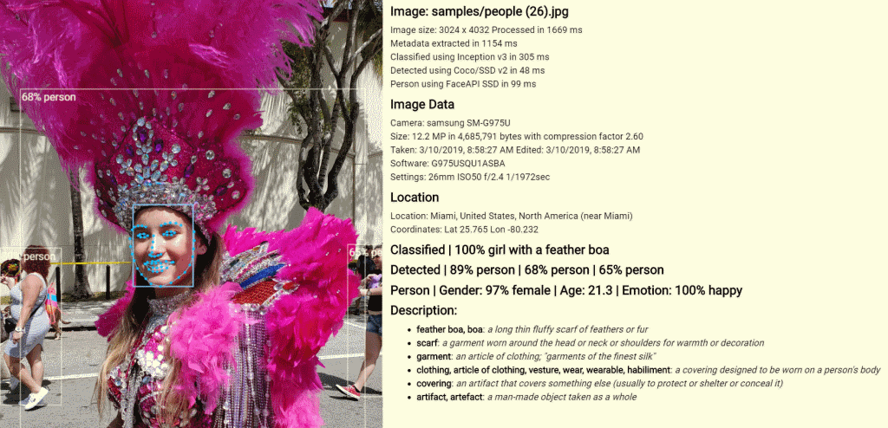
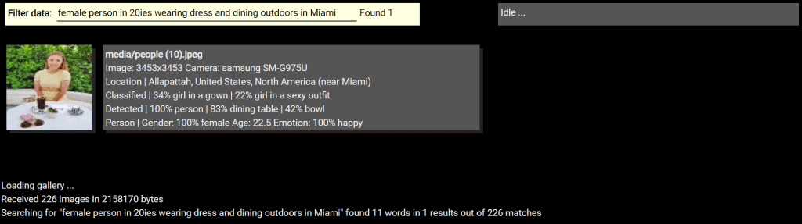
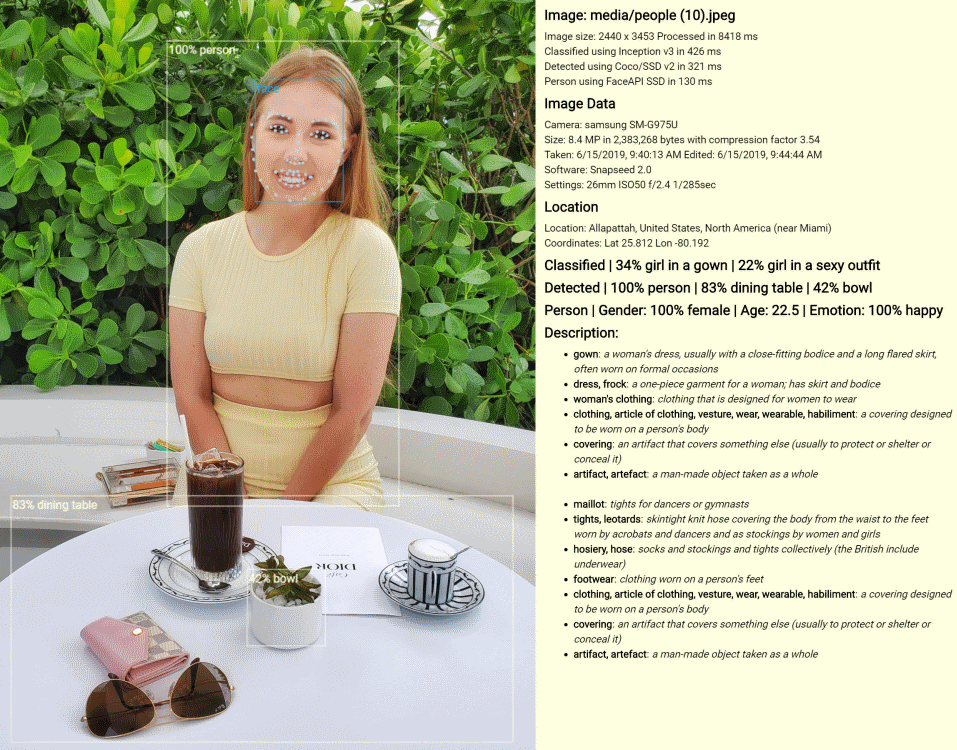

# photo-analysis

## Photo Analysis using TensorFlow/JS

## Server

Serves media files to client application and extracts metadata on-demand.

- Place all images and/or videos inside `./media`.
- If you want to access images already on your drive, symlink folder to location inside `./media`
- Run server application using `node server.js`
- Server uses ParcelJS to build distribution in `./dist` and starts ExpressJS HTTP server
- Note that files in `./dist` are provided only for reference as they will be rebuild on each server start from files in `./client`

## Client

Runs main classification, detection and prediction.

- Modify `./client/config.js` as needed. Entries should be self-explanatory.
- Provide pretrained models or download them in runtime. Default location for models is `./models`
- Connect to <http://localhost/gallery> for image gallery processing
- Connect to <http://localhost/video> for real-time video processing

## General Notes

### Processing

- Batch processing skews per-test performance numbers. If performing specific performance tests, limit batch size to 1.
- Batch sizes above 10 do not further increase performance.

### Input Images

- Large images can cause random WebGL processing errors, recommended limit is 1000px.
- There is no increased accuracy in image sizes larger than 800 pixels as individual classification samples are typically 224px.
- Increase of resolution from 800px to 1000px doubles processing time
- Image ratios matter as tensor calculations are mostly square.
- Smaller objects are easier to detect due to cleaner bounding boxes. Image with single large object that covers 100% of the image is worst-case scenario.

### Pre-trained Models

- Size of pretrained model is not related to performance as larger models can sometimes predict objects easier.
- All models are pretrained using ImageNet dataset with 1,000 classes
- Ideally, models should be trained using full ImageNet dataset that contains 14,197,087 images in 21,841 classes
- If model is depth-based, testing is provided with depth factor 1.0. Lower depth decreases accuracy and higher depth rarely increases it.
- Typcal resolution for pretrained models is 224px resolution although it can vary
- Model warm-up time can be from few seconds to over a minute depending on model complexity

### Benchmarks

Using Intel i7 with nVidia GTX-1050
Sample is of 200 random images with image size 800px

#### Image Classification

| Model               | Size   | Tensors | Accuracy | False Positive | Performance |
|---------------------|--------|---------|----------|----------------|-------------|
| MobileNet v1        |  16 MB |  72     | 82.81%   | 13.2%          |  99 ms      |
| MobileNet v2        |  13 MB | 125     | 82.81%   |  3.5%          | 104 ms      |
| Inception ResNet v2 | 223 MB | 500     | 89.84%   | TBD            | 135 ms      |
| ResNet v2           | 178 MB | 283     | 81.25%   | TBD            | 150 ms      |
| Inception v1        |  26 MB | 120     | 78.13%   | TBD            | 105 ms      |
| Inception v2        |  44 MB | 145     | 78.13%   | TBD            | 110 ms      |
| Inception v3        |  95 MB | 194     | 85.94%   |  9.5           | 127 ms      |
| NasNet Mobile       |  21 MB | 574     | 78.91%   | TBD            | 119 ms      |

It's a tight race between MobileNet v2 with it's small size and low number of false positives .vs.
Inception v3 with long warmup time, good top results but also higher number of false positives.
Note that Inception rates it's hits very high, so if its combined with some other model, it would always end on top.
ResNet on it's own is not that great, but Inception based on ResNet does provide results although that comes with high cost in warmup times and memory usage.

#### Image Object Detection

| Model                | Size   | Tensors | Accuracy | False Positive | Performance |
|----------------------|--------|---------|----------|----------------|-------------|
| Coco/SSD v2          |  67 MB | 202     | 60.94%   |  1.8%          | 147 ms      |
| DarkNet/Yolo v1 Tiny |  63 MB |  42     | 34.38%   | TBD            | 139 ms      |
| DarkNet/Yolo v2 Tiny |  44 MB |  42     | 50.00%   | TBD            | 145 ms      |
| DarkNet/Yolo v3 Tiny |  35 MB |  59     | 29.69%   | TBD            | 136 ms      |
| DarkNet/Yolo v1 Full | 248 MB | 366     | 62.50%   | TBD            | 280 ms      |

Note that with object detection, accuracy is typically lower, but there are much fewer false-positives.
This allows for fallback solutions - if one model does not perform well on an image, you can try another.

### Impact of Precision

Time to analyze sample of simple/medium/complex images also depends on chosen float precision (configurable in `config.js`)

- 32bit: 436/654/866 ms average
- 16bit: 406/628/779 ms average

## Links

- TensorFlowJS: <https://www.tensorflow.org/js/>
- Datasets: <https://www.tensorflow.org/resources/models-datasets>
- MobileNet: <https://github.com/tensorflow/models/blob/master/research/slim/nets/mobilenet/README.md>
- DarkNet Yolo: <https://pjreddie.com/darknet/yolo/>
- Face/Gender/Age: <https://github.com/justadudewhohacks/face-api.js>
- PoseNet: <https://github.com/tensorflow/tfjs-models/tree/master/posenet>
- BodyPix: <https://github.com/tensorflow/tfjs-models/tree/master/body-pix>
- NSFW: <https://github.com/infinitered/nsfwjs>

## Todo

- Bug: canvas overlaps video element so controls are unavailable
- Feature: Configurable locations
- Feature: Sort gallery
- Feature: Show/hide gallery elements
- Feature: Resizable thumbnails
- Future: Server-side paging

## Screenshots

### Gallery view

### Detailed View

### Comples Search Results

